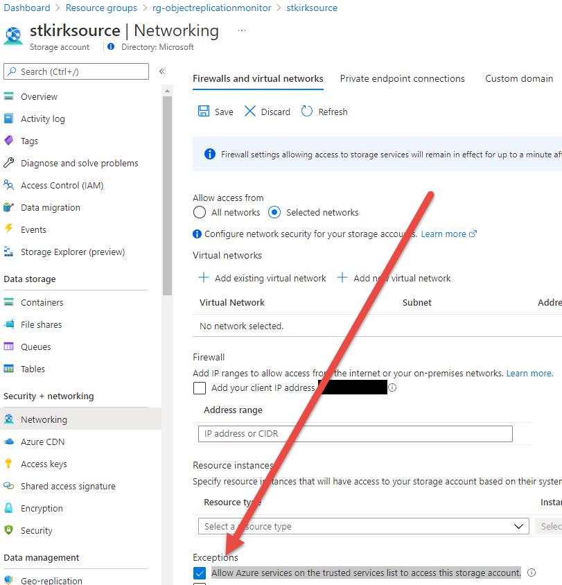

# Azure Storage Object Replication Monitor
This sample will create an Azure Logic App that checks each newly created Azure Storage blob to determine if object replication was successful. The status is logged to an Azure Log Analytics workspace in a custom table to facilitate reporting and monitoring. 

The sample is deployed with ARM templates, providing a sample to understand deploying Logic Apps with API connections to both Event Grid and Log Analytics. It also demonstrates using a managed identity to securely connect to a data source as a trusted service. 

## Overview
This solution uses Azure Event Grid to subscribe to BlobCreated events for an Azure Storage Account. Event Grid is an eventing backplane that enables event-driven, reactive programming. It uses the publish-subscribe model. Publishers emit events, but have no expectation about how the events are handled. Subscribers decide on which events they want to handle. For more information on Event Grid, see [Choose between Azure messaging services - Event Grid, Event Hubs, and Service Bus](https://docs.microsoft.com/en-us/azure/event-grid/compare-messaging-services#azure-event-grid).

This sample deploys an Azure Logic App that subscribes to an Event Grid topic and then periodically queries an Azure Storage blob using a REST API call to check the HTTP headers returned to determine if object replication of that blob was successful. If the status doesn't contain the string literal "x-ms-or" then the workflow pauses for a time period set in the Parameters (default is 1 minute) before checking again. If the status contains the "x-ms-or" header, it checks to see if the replication was successful or failed and logs the appropriate status in Azure Log Analytics. If the x-ms-or header is not returned within a number of attempts (set in the Parameters section in the workflow) then a status indicating timeout is logged to Azure Log Analytics.

Once the sample is deployed, simply upload blobs to the Azure Storage Account container. There is a sample script `test/uploadClient.sh` that can be used to upload blobs from a folder. 

Azure Event Grid will deliver a notification to the Logic App endpoint, initiating an execution run.

You can inspect the individual run to determine what was sent to Azure Log Analytics.

Using the Azure Log Analytics Data Collector invokes the Log Analytics Ingestion API. This will create a new custom table. 

This table can then be queried for replication status over time. 

To help with sample queries, a sample Azure Workbook is deployed that contains several queries to get you started. You can edit this workbook and add additional interesting items such as Azure Storage account metrics for ingress, egress, and latency.

## Deploying the Sample
The sample can be deployed using the `test/deploy.sh` Bash script. Make sure to provide a unique resource group and storage account name for your environment. This script will create the source and target storage accounts, enable object replication between them, deploy the Log Analytics and Logic App resources and supporting artifacts, and will assign the Logic App the "Blob Storage Data Reader" RBAC permission on the storage account. 

## Secure Access to Storage Account
It is assumed that the Azure Storage account may be locked down to a specific network subnet using a private link endpoint or restricted using a service endpoint. The Logic App enables this scenario by using the HTTP action to query the REST API for the storage account using a managed identity. Doing so requires  the setting `Allow Azure services on the trusted services list to access this storage account` to be enabled so that the Logic App can access the Storage Account (which is only allowed because the Managed Identity of the Logic App was granted permission).

For more information on this scenario, see [Authenticate access to Azure resources using managed identities in Azure Logic Apps](https://docs.microsoft.com/en-us/azure/logic-apps/create-managed-service-identity). 

For more information on Azure Trusted Services, see [Grant access to trusted Azure services](https://docs.microsoft.com/en-us/azure/storage/common/storage-network-security?tabs=azure-portal#exceptions). 

